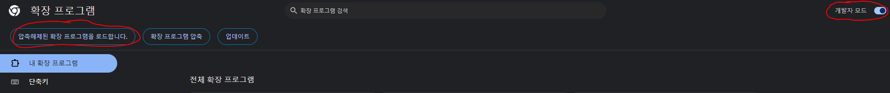

## 크롬 브라우저 투명도 조절기능 extension

### 설명
- 회사에서 맘 편하게 뉴스 기사를 읽기 위해 만든 크롬 확장 프로그램
- 회사에서 점심시간을 제외하고 8시간 일한다고 했을 때, 8시간 내내 일하는 사람은 아마 없을 것이다
- 그런데 회사라는 공간 특성상 대놓고 모니터에 네이버 뉴스를 띄워놓고 읽기는 눈치가 보인다.
- 카카오톡 대화방 투명도 조절처럼 브라우저 자체도 투명도 조절이 가능하다면 어떨까?
- 크롬 확장 프로그램 스토어에 찾아보니 해당 기능을 탑재한 확장 프로그램 찾기 실패
- 답답해서 내가 만들었다   
- 슬라이더 라벨을 조절함으로써 브라우저 자체의 투명도 조절 가능

### 사용 방법
- chrome://extensions/ 혹은 '설정 -> 확장 프로그램 -> 확장 프로그램 관리'에 들어간다

- 우측 상단에 "개발자 모드"를 켠다.
- 좌측 상단에 "압축해제된 확장 프로그램을 로드합니다." 클릭
- git clone 한 폴더를 선택, 등록하면 됩니다.

**Happy Slack!!**